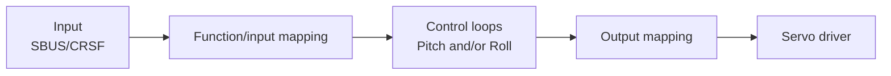

# Architecture: receiver-to-servo data flow

Status: design sketch, not yet implemented — captures the intended shape
of the pipeline before any driver/control-loop code gets written. See
repo root README's Status section for what actually exists today.

Simplified to just the path from receiver input to servo output — no
sensor (IMU/baro) input into the control loops shown yet, that gets added
once this shape is settled.

## Function/input mapping

Assigns semantic meaning to each raw RX channel — configurable, not
hardcoded. A channel is either a straight **passthrough** (raw value flows
through unmodified) or a named **function** (a mode switch, or a target/
setpoint value feeding a control loop).

Example table:

| Channel | Mapping |
|---|---|
| CH1 | Passthrough |
| CH2 | Pitch mode `[Off / Limit / Active]` |
| CH3 | Passthrough |
| CH4 | Pitch target |
| CH5 | Passthrough |
| CH6 | Roll mode `[Off / Active]` |
| CH8 | Passthrough |
| ... | ... |

This is the layer that makes RX pluggable (SBUS vs. CRSF) invisible to
everything downstream — control loops and output mapping only ever see
named functions/passthroughs, never raw channel numbers or a specific
protocol's framing.

## Control loops

One control loop per controlled axis (Pitch, Roll, ...), each driven by
its own mode + target inputs from the mapping layer above. A loop in `Off`
mode produces no output; the channels feeding it are presumably routed as
passthrough instead at the output mapping stage.

## Output mapping

Maps named signals — passthrough channels or a control loop's output — to
physical servo slots. Configurable the same way the input mapping is.

Example table:

| Servo | Source |
|---|---|
| S1 | CH1 |
| S2 | Pitch control output |
| S3 | CH3 |
| S4 | Roll control output |

## Servo driver

Takes the final per-servo values from the output mapping stage and drives
the actual PWM/output hardware. Doesn't know or care whether a given
servo's value came from passthrough or a control loop.
