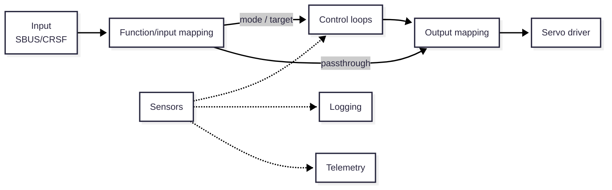

# Architecture

Status: mixed — captures the intended shape of the firmware; several
chains below are now real and bench-verified (or pending
bench-verification, see repo root README's Status section and
[.docs/hardware.md](../hardware.md)'s feature/board matrix for exactly
which). Each page's own `Status:` line says how much of it exists today.

This is the overview. Each major chain gets its own page, added over time
as it gets designed — don't expect every page below to exist or be filled
in yet; a page that's just a stub says so at its own top.

## Pages

| Page | Covers |
|---|---|
| [module-architecture.md](module-architecture.md) | Cross-cutting: module lifecycle, task priority tiers, inter-stage queues, fault isolation/supervisor, crash safety — the convention every chain below is built on |
| [receiver-to-servo.md](receiver-to-servo.md) | RX input, function/input mapping, failsafe, output mapping, servo driver |
| [control-loops.md](control-loops.md) | Per-axis control loops, mode transitions, timing/rate constraints |
| [sensors.md](sensors.md) | Sensor driver model, onboard vs. peripheral, hard-required vs. optional |
| [telemetry.md](telemetry.md) | Reporting state back to the pilot's radio — S.Port real on `matek_h743`, CRSF still a stub everywhere |
| [logging.md](logging.md) | Stub — blackbox/logging, not started |

## Conventions for these pages

- Each page starts with its own `Status:` line — a page should be
  readable on its own if someone lands on it directly, not only in order.
- Cross-reference sibling pages by relative link
  (`[sensors.md](sensors.md)`) rather than repeating their content.
- New chains get their own page here, added to the table above, instead
  of growing inside an existing page once they're substantial enough to
  stand alone — this doc started as one file and got split for exactly
  that reason.
