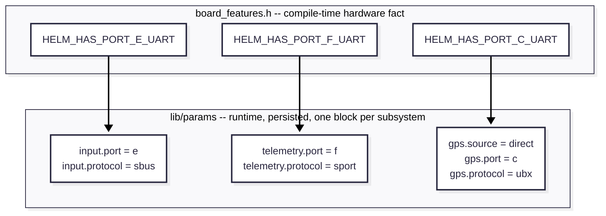
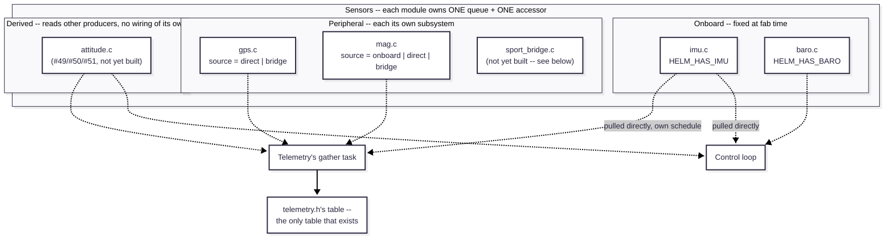

# Ports, sources, and protocols

Status: designed, not yet implemented — see
[#52](https://github.com/heimdall-suite/heimdall-helm/issues/52)/[#53](https://github.com/heimdall-suite/heimdall-helm/issues/53)/[#54](https://github.com/heimdall-suite/heimdall-helm/issues/54)/[#55](https://github.com/heimdall-suite/heimdall-helm/issues/55)/[#56](https://github.com/heimdall-suite/heimdall-helm/issues/56)/[#57](https://github.com/heimdall-suite/heimdall-helm/issues/57)
for the landing sequence. This page replaces the `HELM_HAS_GPS`-style
board-feature flag that [sensors.md](sensors.md) used to describe as
correct — it wasn't, once more than one board is in the picture. See
[README.md](README.md) for how this page fits with the rest of the
architecture docs.

## The problem this replaces

`HELM_HAS_GPS` conflated three separate facts into one compile-time bit:
that a UART is wired to a GPS header, that its role is GPS, and that
there's only one possible port it could ever be. That was only ever true
by accident on `matek_h743` (one UART, one header) — it breaks the moment
a board has more than one candidate port (`nexus_xr`) or more than one
manufacturer-suggested GPS-capable header (`matek_h743` itself turns out
to have two — see [hardware.md](../hardware.md)'s port tables).

## Onboard fact vs. runtime choice

Not "sensor vs. peripheral" — the real dividing line is whether there's
*ever* a genuine reason to choose differently:

- **Never a real alternative** (IMU, baro): stays a plain
  `board_features.h` compile-time fact (`HELM_HAS_IMU`/`HELM_HAS_BARO`),
  exactly as today. No params involved, ever.
- **A real alternative sometimes exists, even on a board that has the
  thing built in** (magnetometer: motor/current interference near the
  PCB is a well-known real reason to prefer an external compass over an
  onboard one): a runtime, params-backed choice. `HELM_HAS_MAG` (a real
  hardware fact, when a board has one) feeds into *which* choices are
  legal, but doesn't force the choice.
- **Always external, connector-hosted, sometimes routable to more than
  one physical port** (GPS): always a runtime choice.

## Subsystem owns port + protocol + source

Ownership is inverted from what a port-centric model would suggest. A
port does not declare a role. Each **subsystem** (`gps`, `mag`, `input`,
`telemetry`, and any future one — a bridge is just another subsystem, see
below) owns its own params:

- **`<subsystem>.port`** — which physical port, by letter
  ([hardware.md](../hardware.md)'s per-board tables).
- **`<subsystem>.protocol`** — how it decodes what arrives.
- **`<subsystem>.source`** — only for subsystems where more than one
  origin is real: `onboard` (fixed chip, legal only where
  `board_features.h` says it's actually there), `direct` (uses
  `.port`+`.protocol`), or a bridge subsystem's own name (e.g.
  `sport_bridge`, once one exists). `.port`/`.protocol` are only
  meaningful when `.source = direct`.

A port's "current role" is a *derived* fact — whichever subsystem's
`.port` currently points at it — never stored per-port.



Worked CLI interaction (`param set <name> <value>`, no new CLI verb
needed):

```
> param set gps.source direct
> param set gps.port c
> param set gps.protocol ubx
```

## Port collision validation

Two checks whenever `<subsystem>.port` is set:

1. **Does this port exist on this board** — against `board_features.h`'s
   `HELM_HAS_PORT_<X>_*` flags.
2. **Is it already claimed by a different subsystem** — a port can be
   claimed by exactly one subsystem, full stop. Reject at `param set`
   time, never silently accept and leave hardware misconfigured at boot.

This isn't a software-policy choice for check 2 — it's a real hardware
one. Two different protocols on one USART peripheral need genuinely
incompatible baud-rate/frame-format configs, and a USART has exactly one
such config shared across both its pins. `matek_h743`'s Port E is the
concrete case: SBUS uses only its RX pin, leaving TX completely idle —
but that idle pin still can't carry an independent S.Port stream, because
the peripheral can't run two configs at once. An idle pin doesn't mean a
free protocol slot.

## Deliberately out of scope: generic port sharing

FPort and CRSF's single-wire telemetry are real — a receiver can carry
input and telemetry together on one wire — but this is **not** modeled
generically in the core. `lib/rx/crsf.c` already has its own bespoke
mechanism for CRSF (`rx_crsf_queue_telemetry()`, an idle-window hook into
the RX driver) and keeps working exactly as it does today. If FPort is
ever wanted, same treatment: its own protocol-specific plumbing in its
own driver, not a "omit `.port`, derive it from another subsystem"
feature of the core model. Splitting genuinely different protocols across
one UART is hard to generalize correctly (see the port-collision
reasoning above); simpler to let each protocol that needs it solve it
locally. `matek_h743` keeps SBUS (Port E) and S.Port (Port F) on two
always-separate ports.

## Four producer categories, one identical interface outward

Every sensor module — regardless of which of these four categories it
falls into — exposes the exact same `{value, status}` queue and a
`<module>_get_latest()` accessor. No consumer (control loop, telemetry's
gather task, logging) ever learns which kind it's reading from.



- **Onboard** — `imu.c`, `baro.c`. Fixed at fab time, no `.source`.
- **Direct peripheral** — `gps.c`/`mag.c` with `.source = direct`, own
  `.port`/`.protocol`.
- **Bridge-relayed** — `.source` names a bridge subsystem (e.g.
  `sport_bridge`). The relaying module (`gps.c`, `mag.c`, ...) does no
  computation, just republishes whatever the bridge already decoded,
  under its own stable accessor.
- **Derived/computed** — `attitude.c` (issues #49/#50/#51): pulls
  `imu_get_latest()` (hard-required) and, once yaw estimation exists,
  `mag_get_latest()` (optional — grounds yaw drift, per the
  hard-required/optional tier [sensors.md](sensors.md) already defines;
  degrading to gyro-only integration on `STALE`/`FAILED` mag status is
  the existing decided behavior, not a gap). Has no port/protocol/source
  of its own — it's not reading hardware, it's reading another module's
  already-resolved output. This is already anticipated by
  [telemetry.md](telemetry.md)'s own example field list, which names
  `TELEM_ATTITUDE_PITCH` before #49 even exists — the gather task was
  never actually limited to pulling from `lib/sensors/` modules
  specifically, only from *any* accessor.

**No shared "sensor table" exists anywhere upstream of telemetry.** Each
sensor module owns exactly one queue; every consumer pulls directly from
the specific module it wants, at its own rate — the pull-not-push
convention [module-architecture.md](module-architecture.md) already
documents. The *only* table that exists is `telemetry.h`'s own, built by
its gather task pulling from whichever accessors it needs.

## Telemetry bridges (enabled, not yet built)

A bridge is the FC acting as an S.Port bus **master** — polling
third-party smart sensors itself, the role a FrSky receiver normally
plays — opposite direction from today's `lib/telemetry/sport.c`, which is
an S.Port **slave** (answers a receiver's polls with this FC's own data).
`sport_bridge.c` isn't a different architectural layer sitting behind a
sensor; it's just another peripheral subsystem, same mechanics as
`gps.c`/`mag.c`, with its own `.port`/`.protocol`. Other subsystems relay
from it via `.source = sport_bridge`. Since S.Port is a genuine multi-drop
bus, one bridge can back several downstream relays at once — a GPS and a
magnetometer both on the same physical bus, `gps.source = sport_bridge`
and `mag.source = sport_bridge`, one port claim between them.

Other bridge types (`hott_bridge`, `ers_bridge`, `sbus2_bridge`,
`exbus_bridge`) are the same pattern, for whenever one is wanted — each
is purely additive: a new subsystem name, zero changes to the core model.

Not built by any issue in the current landing sequence (#52–#57) —
explicitly enabled by this architecture, not designed or scoped yet.

## Worked example: a GPS+compass combo module

A u-blox M9N-Micro-style module bundles two unrelated chips behind one
connector: the GPS chip on UART, a separate compass chip on I2C. In this
model that's simply two ordinary, independent `direct` claims — `gps.port`
on whichever UART the module's TX/RX pins land on, `mag.port` on whichever
I2C bus its SDA/SCL pins land on (a *different* port letter, since I2C
buses get their own letters, separate from UART letters — see
[hardware.md](../hardware.md)). The firmware never needs to know the two
chips share a physical enclosure; nothing about "combo module" needs
special handling.

## See also

[hardware.md](../hardware.md) for the actual per-board port inventories
this model is defined against, and [sensors.md](sensors.md) for the
onboard/peripheral split and the hard-required/optional status tier this
page builds on.
