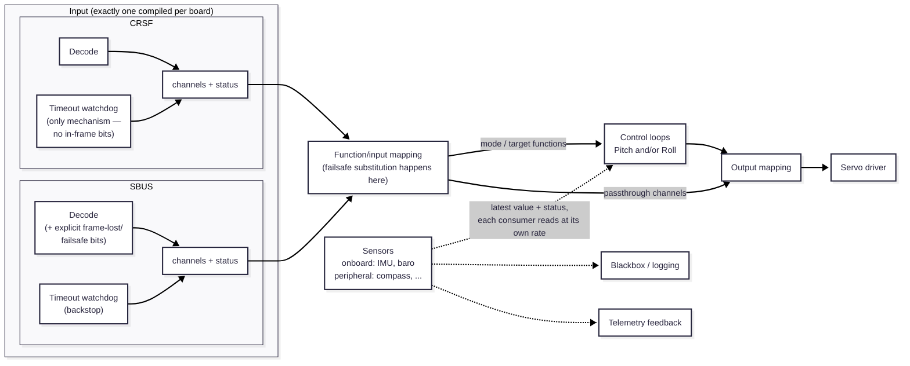

# Receiver-to-servo flow

Status: design sketch, not yet implemented. See [README.md](README.md)
for how this page fits with the rest of the architecture docs.

Passthrough channels skip the control loops entirely — they go straight
from input mapping to output mapping. Only channels mapped to a mode or
target function feed a control loop (see [control-loops.md](control-loops.md)
for what happens there).

## Function/input mapping

Assigns semantic meaning to each raw RX channel — configurable, not
hardcoded. A channel is either a straight **passthrough** (raw value flows
through unmodified) or a named **function** (a mode switch, or a target/
setpoint value feeding a control loop).

Example table:

| Channel | Mapping |
|---|---|
| CH1 | Passthrough |
| CH2 | Pitch mode `[Off / Limit / Active]` |
| CH3 | Passthrough |
| CH4 | Pitch target |
| CH5 | Passthrough |
| CH6 | Roll mode `[Off / Active]` |
| CH8 | Passthrough |
| ... | ... |

This is the layer that makes RX pluggable (SBUS vs. CRSF) invisible to
everything downstream — control loops and output mapping only ever see
named functions/passthroughs, never raw channel numbers or a specific
protocol's framing.

## Failsafe

Substitution happens **at the input mapping stage**, nowhere else:

- **Not in the RX driver** (`sbus.c`/`crsf.c`) — a protocol driver
  shouldn't know that CH2 means "Pitch mode." It only reports channels +
  an honest signal status.
- **Not in the servo driver** — it stays dumb, "doesn't know or care"
  whether a value came from passthrough or a control loop (see below). It
  has no basis to pick a safe value per physical servo, and doing it there
  wouldn't stop a control loop from meanwhile chasing a stale target.
- **At the mapping stage**, because that's the only place that knows both
  the RX signal status *and* what each channel semantically means. Each
  mapped function carries its own failsafe value: a mode function forces
  to a safe mode (most likely `Off`), a target function forces to a safe
  setpoint, a passthrough channel forces to a configured safe position
  (hold-last vs. a fixed preset — not decided yet).

Because substitution happens exactly once, before anything fans out,
**nothing downstream needs failsafe-awareness at all** — control loops,
output mapping, and the servo driver just run their completely normal
logic against whatever the mapping stage now presents. A mode forced to
`Off` during failsafe produces no output using the exact same "Off
produces no output" behavior that already exists for a pilot deliberately
selecting `Off`.

**Control-relevant status is only two tiers, `OK` vs. `FAILSAFE`** — a
brief frame-loss gap doesn't need its own behavioral branch, because
"hold the last known value" isn't something that needs code to make
happen: the driver simply doesn't update its latest-value struct on a
failed decode, so any consumer reading it already sees the previous good
values, automatically. There's no point where the mapping stage needs to
notice a gap and *decide* to hold — holding is just what "no update
happened" already looks like.

A finer-grained frame-loss signal (SBUS's explicit bit, or a receive-age
timer for CRSF) is real and useful, but as **diagnostic data for logging
and telemetry** — link-quality/frame-loss-rate feedback — not as a third
status tier other logic branches on. Keep it as a separate field (e.g. a
last-frame-age or loss counter) alongside the `OK`/`FAILSAFE` status,
consumed by logging/telemetry the same "latest value" way sensor data is,
rather than folding it into the value that gates mapping-stage
substitution.

**No separate pipeline stage needed to normalize any of this** —
`lib/rx/rx.h`'s interface contract already guarantees `sbus.c` and
`crsf.c` report the same shape, regardless of how each arrives at it. The
mapping stage (and everything after it) never needs to know which
protocol is in use.

That said, the two drivers aren't fully independent in *how* they detect
loss, which is worth designing for even though it doesn't change the
external interface: **SBUS needs a receive-timeout backstop too, not just
its explicit bits.** The failsafe bit only tells you the *receiver*
detected its own RX-to-TX link is down — it says nothing about the wire
between the receiver and this board being cut, or the receiver itself
crashing/browning out, both of which mean no more frames arrive at all,
bit or no bit. So a generic "haven't seen a valid frame in N ms" watchdog
belongs once in `lib/rx/` as shared internal code, used by `crsf.c` as its
*only* detection mechanism and by `sbus.c` as a backstop layered under its
faster, bit-based detection. The bit-parsing itself stays entirely inside
`sbus.c` — CRSF has no equivalent, so there's nothing to share there.

Resuming: once RX status returns to `OK`, the mapping stage presumably
goes back to passing real values through immediately — no separate
"recovery" state currently planned, but worth confirming once this gets
built.

**Not yet decided**: the actual failsafe *values* — what mode is safe per
axis, what a passthrough channel's safe position should be, and whether
hold-last or a fixed preset is right for passthrough. That's a real
per-function, per-boat decision, not an architecture question — flagged
here as open rather than guessed at.

## Output mapping

Maps named signals — passthrough channels or a control loop's output — to
physical servo slots. Configurable the same way the input mapping is.

Example table:

| Servo | Source |
|---|---|
| S1 | CH1 |
| S2 | Pitch control output |
| S3 | CH3 |
| S4 | Roll control output |

## Servo driver

Takes the final per-servo values from the output mapping stage and drives
the actual PWM/output hardware. Doesn't know or care whether a given
servo's value came from passthrough or a control loop.
