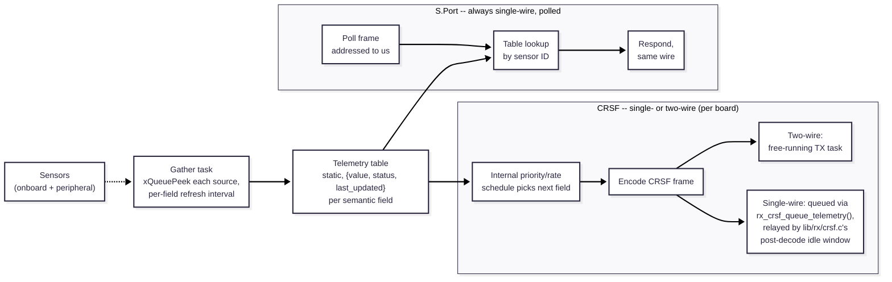

# Telemetry

Status: design sketch, not yet implemented. See [README.md](README.md) for
how this page fits with the rest of the architecture docs.

Telemetry is one of three independent consumers of [sensor data](sensors.md)
(alongside the [control loop](control-loops.md) and
[logging](logging.md)), reporting it back toward the pilot's radio.

## Link quality is not gathered here

Real link-quality/RSSI is the receiver's own responsibility, on both
protocols -- it never flows through the gather task or the table:

- **CRSF**: the receiver injects its own Link Statistics frames into the
  outbound telemetry schedule autonomously. The FC doesn't decode and
  re-transmit this; the receiver reports itself.
- **S.Port**: RSSI is one of the receiver's own sensor IDs on the bus,
  answered by the receiver itself when polled -- again, not FC-produced.

`RxFrame`'s `frame_loss_count`/`last_frame_age_ms`
([receiver-to-servo.md](receiver-to-servo.md)) are a genuinely different,
FC-local metric -- our own timeout watchdog noticing gaps, not an
RF-level measurement. Since the receiver already reports the real number
independently, pushing our synthetic version out as telemetry too would
be redundant under the same "link quality" label. It stays useful for
our own diagnostics (the `diag` CLI command, later blackbox logging) --
just not as a telemetry table field.

## Protocol is the outermost layer

Same "dumb driver" philosophy already used everywhere else in this
repo (RX doesn't know channel semantics, sensor drivers don't know who's
reading them), applied here: the wire protocol is an adapter around a
protocol-agnostic core, not something the core data model knows about.
S.Port and CRSF differ enormously in *how* they decide what to transmit
and when, but both only ever read from the same table.

## Core: a table, gathered by pull

**Static, not heap-allocated.** One entry per semantic field
(`TELEM_BATTERY_VOLTAGE`, `TELEM_ATTITUDE_PITCH`, `TELEM_RX_LINK_QUALITY`,
...), each holding `{value, status, last_updated}` -- the same shape as
`RxFrame`'s `{channels, status, last_frame_age_ms}`, reusing
[sensors.md](sensors.md)'s `OK`/`STALE`/`FAILED` status model rather than
inventing a new one. Fixed-size and allocated at compile time: the crash
hooks already treat `malloc` failure as a fault condition to guard
against ([module-architecture.md](module-architecture.md)'s Crash
safety section), so a telemetry data model with unpredictable allocation
timing would cut against that.

**Populated by pull, not push**, same convention as every other
inter-stage edge in this codebase
([module-architecture.md](module-architecture.md)'s "Inter-stage data"
section): a single gather task `xQueuePeek`s each source's own
latest-value queue (sensor queues, RX's diagnostic fields) and copies
into the table, rather than every sensor/RX module reaching out to write
into telemetry directly.

**Per-field refresh interval, not one fixed tick.** Onboard sensors and
peripherals warrant different rates -- the gather task runs at the
fastest interval any field needs, skipping fields whose interval hasn't
elapsed yet on a given pass. Same decoupling principle
[control-loops.md](control-loops.md) already uses for sensor fusion vs.
output rate, applied to the telemetry table instead.

Protocol-specific adapters only ever read this table -- they never reach
into individual sensor/RX driver queues directly.

## S.Port: polled, always single-wire

Not a per-board variant -- S.Port is inherently a single shared bus,
multiple physical sensors on one line, addressed by ID. Reactive by
design: the receiver polls for a specific sensor ID, the adapter looks
up the matching table entry, and responds on the same wire within
S.Port's round-trip budget. Precomputing into the table (rather than
reading a live driver queue inside the poll-response path) is what keeps
that response bounded.

## CRSF: scheduled push, wiring varies per board

Unlike S.Port, CRSF's wiring topology is a per-board hardware fact, not
a protocol constant -- confirmed two-wire and single-wire CRSF receivers
both exist. Nexus XR's onboard ExpressLRS receiver is *guessed*
two-wire, not confirmed (same no-fabricated-hardware-facts rule
`boards/nexus_xr/board.c` already follows for everything else about that
board); an external CRSF receiver wired to matek_h743/afroflight32 could
be either. This wants its own per-board `HELM_HAS_*` wiring flag, same
category as SBUS's RX-invert bit.

Also unlike S.Port, CRSF isn't polled for a specific field -- the FC
decides what to send via its own internal priority/rate schedule (e.g.
link stats often, battery rarely), gated only by "is the wire free":

- **Two-wire boards**: an independent TX line, so this can be a normal
  free-running task reading the table on its own schedule -- the same
  shape as a generic `{init, send}` driver.
- **Single-wire boards**: no independent TX line. The encoded frame is
  handed to `lib/rx/crsf.c` via a hook (`rx_crsf_queue_telemetry(frame,
  len)`) and relayed during the shared UART's post-decode idle window,
  not sent directly. `crsf.c` stays dumb here -- it relays opaque bytes,
  it doesn't interpret them, same as it never interprets channel
  semantics for RX.

## Not yet decided

- The semantic field enum itself (which values telemetry reports at
  all) -- grows incrementally as sensors/logging get built out.
- Exact per-field refresh intervals and the gather task's own period.
- CRSF's internal priority/rate schedule (which fields, how often).
- S.Port sensor-ID assignments per field.
- Naming/shape of the per-board CRSF single-vs-two-wire flag.
- How this relates to `aoa-boat-controller`'s `aoamon.lua`-style
  parameter/config-over-telemetry precedent -- likely ties into the
  parameter-persistence system once that's designed, not before.
